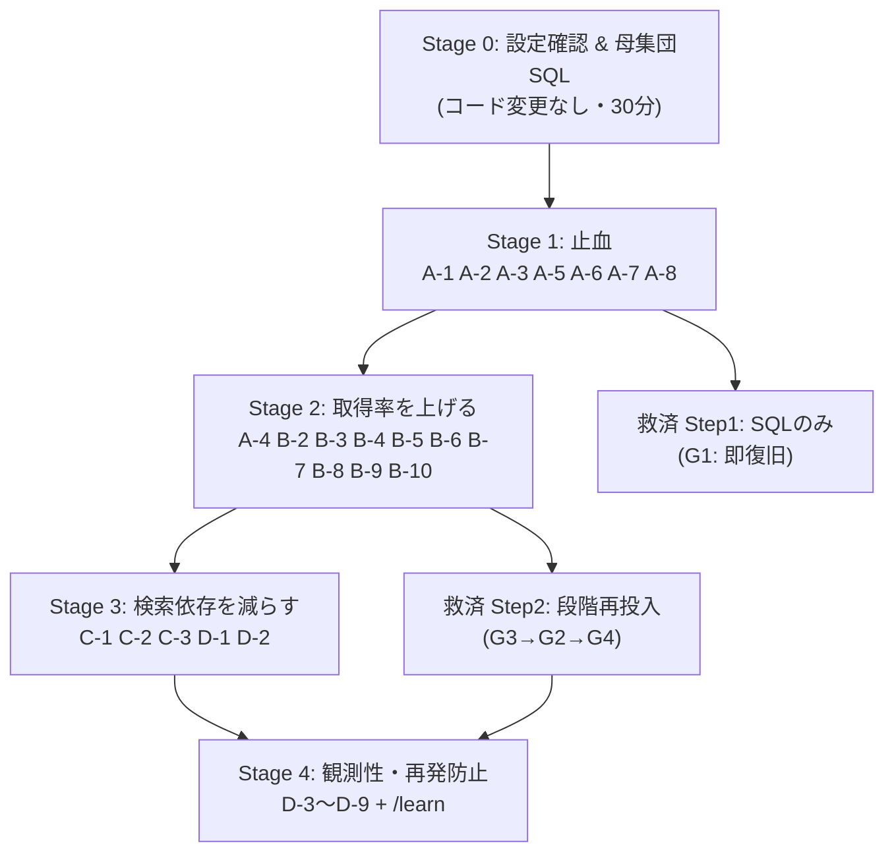

# AI営業メールツール 収集〜調査パイプライン 統合対策計画

## 結論3行

1. **487社中238社が「調査できず」になった主因は、企業ごとの事情ではなく「検索基盤の障害1件」が数百社分の個別失敗として記録され続ける構造**にある(enrichment側にだけ回路遮断が無く、原因分類も残らない)。まず**止血(誤った失敗記録をやめる)**が最優先。
2. **取得率を最も上げるのは「フォームURLの保存」**。実測33社でメール取得は36.4%だが、フォームまで含めた**「連絡可能」は90.9%**。ところが `crawlWebsite` が見つけた `formUrl` はDBに保存する列すら存在せず捨てられている。この1点で「連絡可能な企業」が**+54.5ポイント**増える。
3. **既存238社の相当数は再調査で救える見込み**(ローカル実測ではfailed 43社の100%が同一の設定エラー、うち30%は既にメールを保持済み)。ただし**先に原因分類の列を入れてから**分けて再投入しないと、また同じ失敗を積み増すだけになる。

> **💬 ざっくり**: 「238社は調べても分からなかった」のではなく、「検索の入り口が壊れていたのに、壊れていると言わずに1社ずつ×印を付け続けていた」というのが実態です。入り口を直して、すでに拾えている問い合わせフォームを捨てずに保存するだけで、連絡できる会社の数は一気に3倍近くになります。

---

## 0. 監査結果の統合(重複の解消)

5人の監査員が挙げた**42件の指摘を9つの根本原因に統合**した。同一原因の指摘は1行にまとめ、証拠は全て残している。

| RC | 根本原因 | 統合した指摘(監査員) | 深刻度 |
|---|---|---|---|
| **RC-1** | 検索層そのものが機能不全(DDGパース全滅＋ブロック持続) | search F1/F2/F8 | CRITICAL |
| **RC-2** | 基盤障害と企業固有失敗を区別せず、enrichment側に回路遮断が無い | search F3/F4/F9, failure X1/X2/X3/X5, silent S4 | CRITICAL |
| **RC-3** | 既に手元にある情報を保存せず捨てている | crawl R1, collect C1/C2/C3/C4/C5/C6, failure X8 | CRITICAL |
| **RC-4** | クロールの到達性不足(転送・TLS・外部フォーム・ページ上限・1ホップ) | crawl R2/R3/R4/R5/R6/R9, silent S6/S7 | HIGH |
| **RC-5** | 状態機械の破壊(pending既定・failed上書き・done水増し) | silent S1/S2/S5 | CRITICAL |
| **RC-6** | 抽出品質(破損アドレス・PDFをフォーム誤認) | crawl R7/R8/R10 | HIGH |
| **RC-7** | 検索クエリ設計と候補選定の弱さ | search F5/F6/F7 | HIGH |
| **RC-8** | 観測性・運用導線(失敗理由が画面に出ない・救済ボタンが別ページ) | failure X4/X6/X7 | HIGH |
| **RC-9** | 可用性(DNS解決にタイムアウトが無くジョブロックが張り付く) | silent S3 | HIGH |

### 既存ナレッジベースとの一致(再発パターン警告)

本監査の内容は、**社内KBに既に登録済みのパターン4件と一致**する。うち2件は `recurrence_count=2` で、**今回を数えると3回目=重大警告ラインに到達する**。

| KB_ID | 一致する今回の指摘 | rec |
|---|---|---|
| `KB-PATTERN-untimed-fetch-hang-holds-job-lock` (`patterns/untimed-fetch-hang-holds-job-lock.md`) | RC-9 (`lib/ssrf.ts:142` の `dns.lookup` にタイムアウト無し) | 0 |
| `KB-PATTERN-silent-failure-cascade` (`patterns/silent-failure-cascade.md`) | RC-2 (`lib/crawl.ts:154` `catch { return null; }`)、RC-5 (outcome常に'done') | – |
| `KB-PATTERN-entity-name-match-unreliable-use-canonical-key` (`patterns/entity-name-match-unreliable-use-canonical-key.md`) | RC-7 / RC-3 (社名だけで公式サイトを再特定している=正準キー(掲載URL/ドメイン)を使っていない) | **2** |
| `KB-PATTERN-prompt-rebuild-field-dropout` (`patterns/prompt-rebuild-field-dropout.md`) | RC-3 (`registerCompanies` が `sourceUrl`/`fallbackContact`/`listingTitle` をallow-list漏れでsilent脱落) | **2** |

> ⚠️ **オーナー判断が要る点**: `entity-name-match-unreliable-use-canonical-key` と `prompt-rebuild-field-dropout` は**3回目の再発**にあたる。CLAUDE.mdの規律に従い、対症療法(今回の箇所だけ直す)ではなく**設計レビュー(「名前で引き直す」経路を全廃し正準キーに統一 / 中継層のフィールド受け渡しを型で強制)** を推奨する。着手可否はオーナー判断。

> **💬 ざっくり**: 「社名で検索し直す」「途中の関数でデータを落とす」という同じ失敗が、社内の失敗ノートに既に2回書かれています。今回で3回目なので、その場しのぎではなく仕組みごと直すことをおすすめします。

---

## 1. 対策表(優先度順)

**効果 × 労力**での優先度。P0=即時(今日〜明日) / P1=今週 / P2=後回し / P3=見送り。

### 優先度サマリ

| ID | 対策 | RC | 効果 | 労力 | 優先 |
|---|---|---|---|---|---|
| **A-0** | Serper APIキー・search_mode の設定確認(コード変更なし) | RC-1 | 極大 | XS | **P0** |
| **A-1** | 既知の連絡先/HPを持つ企業を再検索・failed上書きしない | RC-5 | 大 | M | **P0** |
| **A-2** | enrichment に回路遮断(SearchBlockedError)を追加 | RC-2 | 大 | M | **P0** |
| **A-3** | `error_kind` 列を追加し失敗原因を構造化 | RC-2 | 大 | M | **P0** |
| **A-4** | `form_url` 列を追加して保存 | RC-3 | **極大** | M | **P0** |
| **A-5** | AI分析の例外で連絡先ごとfailed化しない | RC-5 | 中 | S | **P0** |
| **A-6** | DNS解決にタイムアウト(ジョブロック張り付き防止) | RC-9 | 中(可用性) | S | **P0** |
| **A-7** | 401/未設定を SearchBlockedError/ConfigError に分類 | RC-2 | 中 | S | **P0** |
| **A-8** | UIに `enrichment_error` を表示+同一理由グルーピング | RC-8 | 中 | S | **P0** |
| **B-1** | DDGスクレイプのリンク抽出修正 + 202をブロック扱い | RC-1 | 大 | S | P1 |
| **B-2** | meta refresh 追従 | RC-4 | 小(実測3%) | S | P1 |
| **B-3** | TLS証明書エラー時のhttpフォールバック | RC-4 | 小(実測3%) | S | P1 |
| **B-4** | MAX_PAGES緩和 + finalUrl重複排除 | RC-4 | 中 | S | P1 |
| **B-5** | 外部フォームSaaSを「フォームあり」として認識 | RC-4 | 中 | M | P1 |
| **B-6** | メール抽出のTLDガード(破損アドレス防止) | RC-6 | 中(誤送信防止) | S | P1 |
| **B-7** | detectFormUrl のPDF除外 | RC-6 | 小 | S | P1 |
| **B-8** | outcome に `done_no_contact` を追加 | RC-5 | 中(可視化) | S | P1 |
| **B-9** | failedタブに「やり直す」ボタン | RC-8 | 中(運用) | S | P1 |
| **B-10** | EXCLUDED_DOMAINS追加 + 集約ドメインを重複除外対象外に | RC-7 | 中 | S | P1 |
| **C-1** | `listing_url` 列追加 + 収集時URL保存 | RC-3 | 大 | M | P1 |
| **C-2** | resolve時に掲載URLを最優先候補として使う | RC-3 | 大 | S | P1 |
| **C-3** | Wantedly `/companies/` JSON-LD から公式サイト直取り | RC-3 | 大(Wantedly経路) | M | P2 |
| **D-1** | 候補ドメインのスコアリング導入 | RC-7 | 中 | M | P2 |
| **D-2** | 検索クエリの多段化(引用符・業種/地域トークン) | RC-7 | 中 | M | P2 |
| **D-3** | 2階層先の連絡先ページ探索 | RC-4 | 中 | M | P2 |
| **D-4** | fetchPage に failureReason を持たせ伝播 | RC-2 | 中 | M | P2 |
| **D-5** | ボット対策ページの検知 | RC-4 | 中 | M | P2 |
| **D-6** | fetchPage の1回リトライ | RC-4 | 小 | S | P2 |
| **D-7** | `enrichment_runs` テーブルで実行履歴を永続化 | RC-8 | 中(事後追跡) | M | P2 |
| **D-8** | fallbackContact / listingTitle の保存 | RC-3 | 小 | S | P2 |
| **D-9** | Serperのステータスコード仕様確認 | RC-2 | 小 | S | P2 |
| **E-1〜E-8** | やらない項目(§5参照) | – | – | – | **P3** |

---

## 2. P0 対策の詳細(今日〜明日)

### A-0. Serper APIキー・search_mode の設定確認 【コード変更なし】

| 項目 | 内容 |
|---|---|
| **対象** | 設定ページ(`settings.serper_api_key` / `settings.search_mode`) |
| **変更方針** | コード変更なし。本番の設定値を確認し、`search_mode='webSearch'`(Serper) かつ有効なAPIキーが入っているかを見る。DDGスクレイプは現状ほぼ100%失敗する(RC-1)ため、メイン経路にしてはいけない。 |
| **想定効果** | ローカルDBでは **failed 43社の100%(43/43)** が `enrichment_error='検索APIが未設定です...'` で完全一致。本番238社の内訳が同傾向なら、**設定1件の修正で最大238社が再調査可能**になる。 |
| **リスク** | Serperの従量課金が発生する。**キーの発行・プラン変更はオーナー判断**(規律04)。 |
| **検証方法** | `SELECT enrichment_error, COUNT(*) FROM companies WHERE enrichment_status='failed' GROUP BY enrichment_error ORDER BY 2 DESC;` を本番で実行し、上位1件が何社を占めるかを数える。ここで「1文字列に大半が集中」が確認できれば、A-0だけで大量救済が成立する。 |

> **💬 ざっくり**: まず「検索の鍵が刺さっているか」を見るだけ。手元のデータでは失敗した43社**全部**が「鍵が無い」というまったく同じ理由でした。本番でも同じなら、設定1つで200社以上が生き返る可能性があります。

---

### A-1. 既知の連絡先/HPを持つ企業を再検索・failed上書きしない 【最も損害が大きい構造バグ】

| 項目 | 内容 |
|---|---|
| **対象** | `lib/db.ts:1208-1226` (`upsertCompany`)、`lib/db.ts:341` (列既定値)、`lib/db.ts:1836-1845` (`markCompanyEnrichmentFailed`)、`lib/enrichment.ts:70-113` (`enrichCompany`)、`importCompaniesWithContacts` |
| **変更方針** | ① `upsertCompany` / `importCompaniesWithContacts` で、`hp_url` または既存の連絡先(email)がある場合は `enrichment_status='done'` を**明示的にINSERT**する(現状は列を書かず既定値'pending'に落ちている)。<br>② `enrichCompany` の冒頭で `company.hp_url` が既に埋まっていれば `resolveCompanyHomepage` による**社名再検索をスキップ**し、既知URLから直接 `crawlWebsite` を再開する分岐を追加。<br>③ `markCompanyEnrichmentFailed` は、**その企業が既に有効な連絡先を持っている場合は status を 'failed' に落とさない**(`done` を維持し `enrichment_error` だけ記録)。 |
| **想定効果** | ローカル実測で **failed 43社中13社(30%)が既に有効なメールを保持**したまま「調査できず」に埋もれていた。本番238社に同比率を当てると**約71社が誤ラベル**の可能性(※ローカルは `csv_import` 偏重のため本番比率は要SQL確認)。加えて、以後の「再調査」操作のたびに同じ破壊が起きるのを止める。 |
| **リスク** | `enrichment_status='done'` を明示INSERTすると、**本来調査したいCSV取込企業が調査対象から外れる**可能性がある。→ 「メールはあるがHP未特定」の企業は `done` にせず `pending` のままにする条件分けが必要。CSV取込のUI文言(「取り込んだ企業を調査します」)との整合も確認すること。 |
| **検証方法** | ① 修正前後で `SELECT COUNT(*) FROM companies c WHERE c.enrichment_status='failed' AND EXISTS(SELECT 1 FROM contacts t WHERE t.company_id=c.id AND t.email IS NOT NULL AND t.email<>'')` が **13→0** になること。<br>② 検索APIキーを意図的に空にした状態で `hp_url` 入りの企業をenrichし、**検索を1回も呼ばずに** crawl まで進むことをログで確認。<br>③ 回帰テスト: CSV取込→即enrich で、連絡先ありの企業が `done` のまま維持されること。 |

> **💬 ざっくり**: すでに「メールアドレスも会社のHPも分かっている会社」に対して、システムがもう一度ゼロから社名検索をしに行き、その検索が失敗すると**元々持っていた正しい情報ごと「調査できず」の札を貼っていました**。手元のデータでは13社がこの被害に遭っています。

---

### A-2. enrichment に回路遮断(サーキットブレーカー)を追加

| 項目 | 内容 |
|---|---|
| **対象** | `lib/enrichment.ts:183-196` (`runEnrichmentBatch` のループとcatch)、`lib/collection-job.ts:46-47`(`ENRICH_TICK_BATCH=20`/`ENRICH_TICK_INTERVAL_MS=5分`)、`lib/collection.ts:363-367`(手本となる既存実装) |
| **変更方針** | ① `runEnrichmentBatch` の catch で `error instanceof SearchBlockedError` を判別し、**そのバッチの残り企業を `pending` のまま処理を打ち切る**(現状は1社ずつcatchして次へ進み、20社を焼き切る)。<br>② 打ち切り時に集約ログを1件出す(例: 『検索APIブロックのため、残りN社を未処理のまま中断』)。<br>③ `settings` に `enrichment_paused_until` を持たせ、`collection-job.ts` の `enrichTick` が起動時にこれを参照して**次の数サイクルをスキップ**する(collection側の `pauseCollectionSource` と同等の停止シグナル)。<br>④ 同一 `error_kind` がN件連続(推奨: 3件)した場合も同様に打ち切る。 |
| **想定効果** | 現状は基盤障害中、**5分おきに20社ずつ機械的にfailed化され続ける**(停止条件は「pendingが尽きる」のみ)。238社という規模はこの「焼き切り」の直接の産物。修正後は障害1件が最大20社止まりになり、**残りはpendingのまま復旧後に自動再開**する。 |
| **リスク** | 打ち切り条件が緩すぎると、たまたま1社が429を返しただけで正常なバッチが止まる。→ 閾値は「連続N件」にし、単発では止めない。`enrichment_paused_until` の解除導線(手動リセット)をUIに置かないと詰まる。 |
| **検証方法** | 検索APIキーを無効値にした状態で `enrichTick` を1回走らせ、**failedになる企業が最大N件(閾値)で止まり、残りがpendingのまま**であることをDBで確認。ログに集約行が1件だけ出ること。キーを戻すと次tickで自動再開すること。 |

> **💬 ざっくり**: 検索が壊れているとき、収集側は「ソースを一時停止」して1回で気づけるのに、調査側は同じ壊れ方でも「この会社は調べられませんでした」を5分おきに20社ずつ延々と記録し続けます。壊れていると分かった時点で手を止めるようにします。

---

### A-3. `error_kind` 列を追加し失敗原因を構造化

| 項目 | 内容 |
|---|---|
| **対象** | `lib/db.ts:337-361`(`addColumnIfMissing` 群)、`lib/db.ts:1836-1845`(`markCompanyEnrichmentFailed`)、`lib/enrichment.ts:78/95/108/193`(4つの失敗呼び出し) |
| **変更方針** | ① `companies` に `error_kind TEXT` を追加(既存 `addColumnIfMissing` パターンをそのまま流用)。<br>② `markCompanyEnrichmentFailed(id, error, kind)` にkind引数を追加。<br>③ 4箇所の呼び出しに固有タグを付与: `search_blocked` / `config_missing` / `hp_not_found` / `crawl_empty` / `name_mismatch` / `analyze_failed` / `unknown`。<br>④ 「基盤起因(config_missing / search_blocked)」と「企業固有(hp_not_found / crawl_empty / name_mismatch)」を区別できるフラグ(または kind の接頭辞)を設ける。 |
| **想定効果** | 直接の取得率向上は無いが、**238社救済の前提条件**。現状は「1件のconfig修正で全部直るのか、238件の個別調査が要るのか」がDBを直接叩くまで判別不能。 |
| **リスク** | ほぼ無い(列追加のみ、既存データは NULL)。既存の failed 行は kind が NULL になるため、救済SQL側で `enrichment_error` 文字列マッチによる後付け分類が別途必要(§4参照)。 |
| **検証方法** | 意図的に4種類の失敗(キー未設定/HP見つからず/クロール0ページ/社名不一致)を再現し、`SELECT error_kind, COUNT(*) FROM companies WHERE enrichment_status='failed' GROUP BY error_kind` が4行に分かれること。 |

---

### A-4. `form_url` 列を追加して保存 【取得率への効果が最大】

| 項目 | 内容 |
|---|---|
| **対象** | `lib/db.ts:139-148`(companies CREATE)、`lib/db.ts:337-361`(addColumnIfMissing群)、`lib/db.ts:1808-1833`(`markCompanyEnriched` のUPDATE)、`lib/enrichment.ts:115-133`(`resolved.crawl.formUrl` が捨てられている箇所)、`lib/types.ts:206-233`(Company型)、`app/collection/companies/page.tsx`(一覧UI) |
| **変更方針** | ① `companies` に `form_url TEXT` を追加。<br>② `markCompanyEnriched` のUPDATE文に `form_url` を含め、`enrichCompany` から `resolved.crawl.formUrl` を渡す。<br>③ `lib/types.ts` の `Company` 型に `form_url` を追加(`CrawlResult.formUrl` は `lib/types.ts:161` で既に計算済み)。<br>④ 一覧UIに「メール未検出・フォームあり」を機械的に絞り込めるフィルタを追加。<br>⑤ **自動送信はしない**。あくまで人力アプローチ用のリストとして扱う(§5-E1)。 |
| **想定効果** | **実測33社: メール取得 12社(36.4%) / フォームのみ 18社(54.5%) / 合計「連絡可能」30社(90.9%)**。メール0件の21社のうち**18社(85.7%)にフォームがある**。<br>本番でローカル比率(done中メール0件が80%)が成立するなら、done相当249社のうち約200社がメール0件 → **その85.7%=約171社が「フォームで連絡可能」として新規に浮上**する。<br>これは全対策の中で**最もレバレッジが高い単一改修**。 |
| **リスク** | ・「連絡可能」件数が跳ね上がるため、既存のダッシュボード数値の意味が変わる(過去との比較には注意)。<br>・フォームURLの品質(PDFリンク等)は B-7 で別途担保。<br>・**フォーム経由の営業をやるかどうかはオーナー判断**。少なくとも自動送信は禁止(§5)。 |
| **検証方法** | 実測に使った33社(スクラッチパッドの `crawl-audit-results.ndjson`)を本番パイプラインで再enrichし、`SELECT COUNT(*) FROM companies WHERE form_url IS NOT NULL` が **18以上**になること。UI上で「フォームあり」フィルタが18社を返すこと。 |

> **💬 ざっくり**: システムはすでに各社の「お問い合わせフォーム」を見つけているのに、**それを保存する箱がデータベースに無くて毎回捨てていました**。33社を実測すると、メールが取れたのは12社ですが、フォームまで数えると30社(9割)に連絡手段があります。箱を1つ作るだけで、営業できる会社が約3倍になります。

---

### A-5. AI分析の例外で連絡先ごとfailed化しない

| 項目 | 内容 |
|---|---|
| **対象** | `lib/enrichment.ts:119-128`(upsertContact)、`:145`(analyzeCompany呼び出し)、`lib/analyze.ts:109-114/124/143/154/168/172`(投げうる例外6種) |
| **変更方針** | `enrichCompany` 内で `analyzeCompany` を try/catch で囲み、失敗時は **`enrichment_status='done'` のまま fit系フィールドのみ空**にする(または `done_analysis_failed` の部分成功状態を設ける)。連絡先は既に保存済みなので巻き戻さない。 |
| **想定効果** | 「メールは取れているのにAI分析だけコケた」企業がfailedに混入するのを防ぐ。件数は未計測だが、Gemini側の一時エラー・安全性フィルタは日常的に起きうる。`getCompaniesForIntegrityCheck`(`lib/db.ts:1889-1907`)が `done` 前提なので、そこから漏れる問題も同時に解消。 |
| **リスク** | fit_score が空の企業が `done` に混ざる → 相性判定を使う画面で「未評価」を表示できるようにする必要がある。 |
| **検証方法** | Gemini APIキーを無効にした状態でenrichを走らせ、メールが取れた企業が `done` かつ `contacts` に行が残り、`fit_score` が NULL であることを確認。 |

---

### A-6. DNS解決にタイムアウト 【ジョブロック張り付き防止・KB既知パターン】

| 項目 | 内容 |
|---|---|
| **対象** | `lib/ssrf.ts:129-162`(`validateUrlWithDns` の `dns.lookup`、142行目)、`lib/crawl.ts:104-116/134`(AbortControllerがDNSフェーズに掛かっていない) |
| **変更方針** | `validateUrlWithDns` の呼び出しを `Promise.race` + 独自タイムアウト(推奨5秒)で包む。理想は `fetchPage` の `FETCH_TIMEOUT_MS=8000ms` タイマーの対象にDNS解決フェーズも含めること(controller.signal をDNSフェーズにも効かせる)。 |
| **想定効果** | 取得率への直接効果は無いが、**「実行中のまま無進行」を防ぐ**。`runEnrichmentBatch` は直列ループのため、1社のDNSハングが最大20社/tickを巻き込み、`COLLECTION_JOB_LOCK_KEY`(TTL 30〜90分)を握ったまま止まる。`lib/collection-trigger.ts:17-19` が202即返しのため**画面にはエラーが一切出ない**。 |
| **リスク** | タイムアウトが短すぎると正常なDNS解決を落とす。5秒は保守的な値。 |
| **検証方法** | 応答しないDNSサーバを指すホスト名でenrichを走らせ、**5秒でnullが返りバッチが進む**こと。KB `patterns/untimed-fetch-hang-holds-job-lock.md` の再発防止チェックリストに照合。 |

---

### A-7. 401/未設定を SearchBlockedError / ConfigError に分類

| 項目 | 内容 |
|---|---|
| **対象** | `lib/keyword-search.ts:70-89`(401の分岐)、`lib/keyword-search.ts:43`(BLOCKED_STATUSES)、`lib/company-resolve.ts:69`(未設定リテラル)、`lib/collection.ts:363/369-381/177`(pause判定と文言) |
| **変更方針** | ① 401 を `SearchBlockedError`(または新設 `SearchConfigError`)として投げる。<br>② DDGの **202 を BLOCKED_STATUSES に追加**(現状は `res.ok=true` で静かに0件)。<br>③ `collection.ts:177` の pause 文言を error_kind に応じて出し分ける(『APIキーが無効です』/『アクセスがブロックされました』を区別)。現状は全て「HTML構造が変わった可能性」と表示され、運用者を誤った調査に誘導している。 |
| **想定効果** | キー失効時に**最大3サイクル(=最大60社)無駄に叩き続ける**のを止め、停止メッセージが真因を指す。A-2と組み合わせて初めて効く。 |
| **リスク** | 低。既存の `SearchBlockedError` を投げる箇所が増えるだけだが、A-2未実装のまま入れるとenrichment側でcatchされず素通りするので**A-2とセットで入れる**。 |
| **検証方法** | 無効なAPIキーで収集を走らせ、**1サイクル目で**ソースがpauseされ、pause理由が『APIキーが無効です』になること。 |

---

### A-8. UIに `enrichment_error` を表示 + 同一理由グルーピング 【バックエンド変更不要】

| 項目 | 内容 |
|---|---|
| **対象** | `app/collection/companies/page.tsx:588-682`(STATUS_CONFIG のstatusセル)。データは `app/api/companies/route.ts:23-28` → `lib/db.ts:1167-1180`(`SELECT c.*`)で**既にフロントに届いている**。 |
| **変更方針** | ① failed行のステータスセルに `enrichment_error` を `title` 属性またはクリック展開で表示。<br>② failedタブ上部に**同一 `enrichment_error`(A-3後は `error_kind`)でグルーピングした件数サマリ**を出す(例: 『検索APIが未設定です...: 43社』)。 |
| **想定効果** | 取得率への直接効果は無いが、**「238社が同一原因の1件なのか238件の個別事情なのか」を画面だけで判断できるようになる**。オーナーがDBを叩かずに優先順位を決められる。 |
| **リスク** | ほぼ無い。`enrichment_error` に外部エラーメッセージが混ざるため、内部情報漏洩の観点で**社外に見せる画面ではない**ことを確認(社内管理画面なら問題なし)。 |
| **検証方法** | failedタブを開き、サマリ行の合計がfailed総件数と一致すること。各行のホバーで理由が読めること。 |

> **💬 ざっくり**: 失敗理由のデータは**すでに画面まで届いているのに表示していないだけ**でした。「調査できず」の×印の横に理由を出し、上に「この理由が43社」とまとめを置くだけで、原因が1個なのかバラバラなのかが一目で分かります。

---

## 3. P1 対策の要点(今週)

### 検索経路の復旧

| ID | 対象 | 変更方針 | 効果/検証 |
|---|---|---|---|
| **B-1** | `lib/keyword-search-scrape.ts:9-20`(`extractRealUrl` の `/[?&]uddg=([^&]+)/`)、`:62-76` | 200応答時の `.result__a` の **href を生で確認**し、現行のDDG形式(uddg= パラメータが廃止され直接hrefになっている可能性が高い)に合わせて抽出を更新。加えて「`.result` が10件あるのに parsed=0件」の**矛盾検知ログ**を追加し、真の0件と区別する。 | 実測で `.result`=10件 / parsed=**0件** が2クエリ連続。scrapeモードはブロックされていなくても常に0件。**ただし DDGはfallback専用に格下げする前提**(§5-E3)。検証: 修正後に同一クエリで parsed>=5件。 |
| **B-10** | `lib/company-resolve.ts:14-35`(EXCLUDED_DOMAINS 20件)、`lib/db.ts:1747-1751`(`findCompanyByDomain`)、`lib/enrichment.ts:50-54` | ① `baseconnect.io` / `salesnow.jp` / `houjin.jp` / `en-hyouban.com` / `type.jp` / `doda.jp` / `herp.careers` / `job-medley.com` / `findy.co.jp` / `findy-code.io` を追加。<br>② **既知の集約ドメインはドメイン重複除外の対象外**にする(現状、1社が集約ドメインに誤解決すると、以後同じドメインに解決した**別の実在企業が「登録済み」として静かに除外される**)。 | 誤除外の連鎖を止める。検証: 集約ドメインを2社に人為的に設定し、2社目が excluded にならないこと。 |

### クロール到達性(RC-4)

| ID | 対象 | 変更方針 | 実測根拠 |
|---|---|---|---|
| **B-2** | `lib/crawl.ts:104-159`(`fetchPage`) | 本文が極端に短く(<1KB)`<meta http-equiv="refresh" ... URL=...>` を検出したら、そのURLへ**1回だけ**追加fetch。 | 大阪特殊鋼管製造所(otk.ne.jp): HTTP200・本文159バイト・実体は `otk1937.co.jp` への転送タグのみ。**33社中1社(3%)** |
| **B-3** | `lib/crawl.ts` `fetchPage`、`lib/ssrf.ts:81` | TLS証明書検証エラー(`ERR_TLS_CERT_ALTNAME_INVALID` 等)**に限定**して `http://` で1回リトライ。 | 大阪システム販売: https=証明書ミスマッチで例外、http=200・6233バイトの正常ページ。**33社中1社(3%)がクロール完全失敗**。日本の共用レンタルサーバでは頻出。 |
| **B-4** | `lib/crawl.ts:6`(`MAX_PAGES=5`)、`:489`(`slice(0, MAX_PAGES-1)`)、`:190/213-224`(seen) | ① MAX_PAGES を **7〜8** に緩和、または「contact/about を先に取得しメール0件なら残りを追加取得」の段階的クロールに変更。<br>② 取得後の `fetched.finalUrl` も重複排除セットに追加。 | 上限到達サイト4社をスポットチェック→**4/4社(100%)で発見済み候補が1〜2件切り捨てられていた**(giginc/coosy/na-tax/taiyu)。na-tax.jp は転送により `/about/` を2回取得し枠を1つ無駄にしていた。 |
| **B-5** | `lib/crawl.ts:213-215`、`:416-420`(同一origin制約) | 既知の外部フォームSaaS(`smp.ne.jp`, `form.run`, `forms.gle`, `docs.google.com/forms` 等)にマッチする場合は**「外部フォームあり」として別フラグで記録**(origin制約は候補提示段階でのみ緩める。SSRF防御は維持)。 | 阿部建設: 「お問い合わせ」リンクが全て `reg18.smp.ne.jp` の外部フォーム → formUrl=null・メール0件で「連絡手段なし」に誤分類。**33社中1社で直接確認、日本の中小企業サイトでは広く使われるため実際はより多い見込み(規模は未実測)**。 |

**B-5のリスク**: SSRF防御(`lib/ssrf.ts`)を緩めてはならない。**許可リスト方式**(既知SaaSドメインのみ)で実装し、任意の外部originへのfetchを許可しないこと。

### 抽出品質(RC-6)

| ID | 対象 | 変更方針 | 実測根拠 |
|---|---|---|---|
| **B-6** | `lib/crawl.ts:293`(メール正規表現)、`:265-273`(`isPlausibleEmail`) | TLD部分に**長さ上限(24文字)**と既知TLDリスト照合を追加。あわせてcheerioのテキスト抽出でブロック要素間に区切り文字を挿入。 | クーシー(coosy.co.jp): 本文が `privacy@coosy.co.jpTOPプライバシーポリシー` と空白なしで連続し、**`privacy@coosy.co.jptop` という破損アドレス**が抽出結果に混入。今回は正しい方も同時に取れていたが、破損のみだった場合 `contactEmails[0]` として**バウンス送信**に直結する。 |
| **B-7** | `lib/crawl.ts:378-428`(特に420行 `contactUrl = resolved.href;`) | 拡張子 `.pdf`/`.doc`/`.xls` 等を除外、または「PDF案内あり」として別カテゴリ記録。 | 名工建設: formUrl が `...-1.pdf`(ダウンロード用PDF)。**33社中1社(3%)**。A-4でform_urlを本格運用する以上、品質担保は必須。 |

### 状態・運用導線

| ID | 対象 | 変更方針 | 効果 |
|---|---|---|---|
| **B-8** | `lib/enrichment.ts:115-133/135-156`(outcome常に'done'固定) | `EnrichOutcome` に `done_no_contact` を追加し、`runEnrichmentBatch` の tally と完了ログ(🏁行)に反映。 | 実測: **done 59社中メール保持は12社(20%)、47社(80%)が実質未達なのに「調査完了」に混ざっている**。ダッシュボードの数字が実態を大幅に上回る問題を解消。A-4のform_urlと組み合わせ、`done_form_only` も設けるとさらに明快。 |
| **B-9** | `app/collection/companies/page.tsx:46-56/464`(failedタブ)、`app/api/collection/retry-failed/route.ts:8-11` | failedタブに「やり直す」ボタンを追加し、`resetFailedEnrichments` → **即座に `runEnrichmentBatch` をトリガー**する専用エンドポイントを用意(enrich-pending と同じ202非同期パターン)。 | 現状は「failedを眺められる画面」と「failedを復旧できるボタン」が**別ページ**にあり、しかも retry-failed は pending に戻すだけで再調査を開始しない。運用者がこの2ページ2ステップを知らないと238社は「詰まったまま」に見える。 |

### 掲載URLの活用(RC-3の本体 / KB `entity-name-match-unreliable-use-canonical-key` の根本対策)

| ID | 対象 | 変更方針 | 効果 |
|---|---|---|---|
| **C-1** | `lib/db.ts`(addColumnIfMissing群)、`lib/collection.ts:139-167`(`registerCompanies`)、`:153-162`(upsertCompany呼び出し)、`lib/db.ts:1132-1143`(`CompanyInput`) | `companies` に **`listing_url TEXT`** を追加し、`CompanyInput` に `sourceUrl` フィールドを追加、`registerCompanies` から確実に渡す。※`lp_url` は個社LP差し込み用途で実運用中(`lib/compose.ts:362` ほか8箇所)のため**流用不可**、`source_detail` は非構造化のため不適。 | 収集時に**既に手元にある掲載URL**が3経路すべてで捨てられており、後段は毎回「社名で検索し直す」ゼロスタート。238社の主因がここに集約されうる。 |
| **C-2** | `app/api/keyword-search/resolve/route.ts:5-17`、`app/collection/search/page.tsx:252/754-756`、`lib/enrichment.ts:75`(`resolveCompanyHomepage(company.name, "")`) | resolve APIに `sourceUrl`(任意)パラメータを追加。渡された場合は**検索前にそのURLのドメインを最優先候補として検証・クロール**する経路を作る。`enrichCompany` も `company.listing_url` を渡す。 | **検索を1回も呼ばずに公式サイトへ到達できるケースが生まれる** = 検索ブロック・検索コスト・誤ヒットの3問題を同時に回避。UIはsourceUrlを表示だけしており(クリック可能)、活用する意図があった痕跡。 |
| **C-6(付随)** | `lib/keyword-search.ts:197-208`(AIプロンプト) | sourceUrl保存に合わせ、登録時に **sourceUrl が `items[].link` のいずれかと一致するか検証**し、不一致なら空扱いにするガードを追加(プロンプト側の制約強化だけに頼らない)。 | 保存するURLが実在のリンクであることを機械的に保証。 |

**C-1/C-2 のリスク**: マイグレーションが必要(A-3 `error_kind` / A-4 `form_url` と**同一のマイグレーションにまとめる**)。掲載URLが求人媒体等の集約ドメインだった場合、それを「公式サイト」と誤採用しないよう **EXCLUDED_DOMAINS(B-10)通過を必須条件**にすること。

**C-1/C-2 の検証方法**: 検索APIキーを空にした状態で、`listing_url` を持つ企業をenrichし、**検索を1回も呼ばずに** crawl が走って `hp_url` が埋まることを確認。

---

## 4. 既存238社の failed 救済手順

> ⚠️ **前提**: この手順は**A-1・A-2・A-3・A-4の実装完了後**に実行すること。今のコードのまま238社を再投入すると、同じ構造で再びfailedが積み増されるだけ。

### Step 0: バックアップと母集団の把握(コード変更前でも実行可)

```sql
-- 0-a. 失敗理由の分布(A-0の判断材料。最優先で実行)
SELECT enrichment_error, COUNT(*) AS n
FROM companies WHERE enrichment_status='failed'
GROUP BY enrichment_error ORDER BY n DESC;

-- 0-b. 「実は連絡先を持っている failed」= 再調査不要で即復旧できる群
SELECT COUNT(*) FROM companies c
WHERE c.enrichment_status='failed'
  AND EXISTS (SELECT 1 FROM contacts t
              WHERE t.company_id=c.id AND t.email IS NOT NULL AND t.email<>'');

-- 0-c. 「HPは既に分かっている failed」= 検索スキップでcrawlから再開できる群
SELECT COUNT(*) FROM companies
WHERE enrichment_status='failed' AND hp_url IS NOT NULL AND hp_url<>'';

-- 0-d. 「done だがメール0件」= form_url 再取得で救える群(A-4の効果測定対象)
SELECT COUNT(*) FROM companies c
WHERE c.enrichment_status='done'
  AND NOT EXISTS (SELECT 1 FROM contacts t
                  WHERE t.company_id=c.id AND t.email IS NOT NULL AND t.email<>'');

-- 0-e. テスト由来データを集計から除外する条件を確認
SELECT source, COUNT(*) FROM companies GROUP BY source;
```

**DBのバックアップを取ってから進める**(`lib/backup.ts` の既存機構を使う)。

### Step 1: 再調査**なし**で救えるもの(SQLのみ・外部アクセスゼロ)

| 群 | 判定 | 処置 | ローカル実測 |
|---|---|---|---|
| **G1: 連絡先を既に保持している failed** | 0-b | `enrichment_status='done'` に戻す(**再調査しない**)。A-1の実装で今後は発生しなくなる。 | **43社中13社(30%)**。本番238社に同比率なら**約71社** ※要0-bで実数確認 |

> **💬 ざっくり**: G1は「メールアドレスはちゃんと持っているのに×印が付いていただけ」の会社。**検索も何もせず、札を貼り替えるだけで営業対象に戻ります。**

### Step 2: 再調査で救える見込みが高いもの(段階投入)

| 群 | 判定 | 処置 | 注意 |
|---|---|---|---|
| **G2: 基盤起因の failed(APIキー未設定・ブロック)** | `enrichment_error` が『検索APIが未設定です...』等 | A-0で設定を直した**後**に `pending` へ戻す。 | ローカルでは**43社中43社(100%)**が該当。本番の比率は0-aで確認 |
| **G3: HPを既に保持している failed** | 0-c | `pending` へ戻す。A-1の実装により**検索をスキップしてcrawlから再開**されるので、検索が壊れていても進む。 | 検索コストゼロ。最初に投入すべき群 |
| **G4: done だがメール0件** | 0-d | A-4実装後に `resetEnrichedWithoutEmail`(既存)で再クロールし **`form_url` を埋める**。 | ローカル実測で **done 59社中47社(80%)**。実測33社の比率(メール0件のうち85.7%にフォームあり)を当てると**大半が「連絡可能」に転じる** |

**投入ペース**: `ENRICH_TICK_BATCH=20` / `ENRICH_TICK_INTERVAL_MS=5分` のため **238社 ≈ 12バッチ ≈ 約60分**。一気に戻しても時間的には問題ないが、**外部サイトへの集中アクセスを避けるため G3 → G2 → G4 の順に、1群ずつ完了を確認してから次へ**進める。

### Step 3: 再調査では救えないもの(手動 or 対象外)

| 群 | 内容 | 対応 |
|---|---|---|
| **G5: 本当にWebサイトが存在しない企業** | 検索も掲載URLも当たらない | 対象外としてマーク。`error_kind='hp_not_found'` で分離できるようにする(A-3) |
| **G6: JS描画のみでメール・フォームが取れないサイト** | crawlは成功するが抽出0件 | 現状の技術では自動化不可。手動リスト行き |
| **G7: 社名不一致(別会社サイトを掴んでいる)** | `companyNameAppearsOnSite`(`lib/enrichment.ts:106`, `lib/data-integrity.ts:61-75`)で弾かれた群 | **手動確認が必須**。ただしボット対策ページを「別会社の疑い」と誤分類しているケースが混ざる(RC-4/D-5)ため、D-5実装後に再判定する価値あり |
| **G8: テスト由来データ** | `source='test'` の61件 + 誤投入8件 | **削除の是非はオーナー判断**(監査中に `scripts/verify-analysis-identity.mts` の誤実行で8件増加。設定値は正しく復元済み・git管理外・リポジトリへの影響なし)。最低限、集計SQLから除外すること |

### Step 4: 効果測定

再調査完了後、以下を Step 0 の数値と比較する。

```sql
SELECT
  SUM(CASE WHEN enrichment_status='failed' THEN 1 ELSE 0 END) AS failed,
  SUM(CASE WHEN enrichment_status='done' THEN 1 ELSE 0 END) AS done,
  SUM(CASE WHEN form_url IS NOT NULL AND form_url<>'' THEN 1 ELSE 0 END) AS has_form
FROM companies WHERE source <> 'test';
-- + contacts を持つ企業数
```

**成功基準(実測ベースの目標値)**:
- failed 238社 → **60社以下**(A-0が効いた場合)
- 「連絡可能(メール or フォーム)」企業比率 → **crawl到達企業の85%以上**(実測33社では90.9%)

---

## 5. やらない方がいいこと(P3・明示的に見送る)

| ID | やらないこと | 理由 |
|---|---|---|
| **E-1** | **フォームへの自動送信** | ① 多くのサイトの利用規約が自動送信・営業目的送信を禁止。② 特定電子メール法のオプトアウト管理・同意記録がフォーム経由では成立しない。③ CAPTCHA回避は不正アクセス禁止法のリスク領域。**A-4で作るのは「人力でアプローチするためのリスト」まで**。フォーム営業を実施するか自体もオーナー判断。 |
| **E-2** | **メールアドレスの推測生成**(`info@ドメイン` 等の自動組み立て) | 実測16件のメールは全て `mailto` または本文正規表現由来で、**推測が当たる裏付けデータはゼロ**。バウンス率上昇 → 送信ドメイン評価の毀損 → **既に取れている正しいアドレスへの到達率まで巻き添え**になる。B-6(破損アドレス防止)と真逆の方向。 |
| **E-3** | **DDGスクレイプをメイン経路として磨き込む** | 実測: 202発火後、**約115秒間の再試行4回が全て202**、無関係な英語クエリ('test query')でも202。クエリ内容に依存せず持続する。**ブロック前提の経路に工数を投資しない**。B-1は「fallback経路として静かに壊れないようにする」までに留め、メインは Serper に固定する。 |
| **E-4** | **Bing実測(公式サイト20% / 会社概要0% / お問い合わせ0%)を根拠にクエリ設計を全面変更** | 30回中15回(50%)が**5社にまたがって完全に同一の辞書的3件**(ja.wikipedia.org/wiki/株式会社 等)を返しており、自動アクセス検知による劣化応答の疑いが濃い。15秒待機後の再クエリでも同一結果が再現。**Serperで再測定してから判断**(D-2はその後)。相対評価(『公式サイト』が3種中最良)としては有効なので、当面は現行クエリを維持。 |
| **E-5** | **JSON-LD / HTML属性のメール抽出経路の削除** | 実測33社での寄与は0/16件だが、母集団が日本の中小企業サイトに偏っている。EC・構造化データ対応サイトでは寄与しうる。保守コストは小さいので**現状維持**。サンプルを増やして再測定してから判断。 |
| **E-6** | **238社を一括で pending に戻して即再実行** | 分類前に戻すと、基盤起因と企業固有が混ざったまま再度焼き切られる。§4の**Step 1(SQLのみ)→ Step 2(群ごと段階投入)** の順を守る。 |
| **E-7** | **Wantedlyのスクレイピング頻度を上げる / 一覧を大量取得する** | C-3は**1社あたり1リクエスト追加**(`/companies/{slug}` を1回)までに留める。既存の `isWantedlyUrl` によるSSRF許可の範囲内で、同一ホストへの既存ウェイト(`CRAWL_DELAY_BASE_MS`/JITTER)を必ず適用する。規約・負荷の両面でこれ以上は踏み込まない。 |
| **E-8** | **テストフィクスチャ(`source='test'` 61件+誤投入8件)の勝手な削除** | **オーナー判断事項**(規律04)。統計を歪めるのは事実なので、まず**集計SQLから除外する条件を入れる**対処に留める。削除するなら別途承認を取る。 |

> **💬 ざっくり**: 「フォームに自動で送る」「メールアドレスを勝手に推測して送る」は、短期的には数字が伸びますが、**規約違反・法令リスク・送信ドメインの信用失墜**で長期的に全体の到達率を壊します。フォームは"人が確認して送るためのリスト"までにします。

---

## 6. 実装ロードマップ(依存関係を考慮した4段階)



### Stage 0 — 即日・コード変更なし(所要30分)

- **A-0**: 本番の `serper_api_key` / `search_mode` を確認 → **キーが必要ならオーナーに発行/課金の承認を取る**
- §4 Step 0 の SQL(0-a〜0-e)を本番で実行し、238社の内訳を確定
- DBバックアップ取得

**ゲート**: 0-a の結果で「1文字列に大半が集中」なら Stage 1 の優先順位は変えず、逆に理由がバラけていたら A-3(分類)を最優先に繰り上げる。

### Stage 1 — 止血(1〜2日) 【最優先】

**マイグレーションを1本にまとめる**: `error_kind` (A-3) + `form_url` (A-4) + `listing_url` (C-1) の3列を **1回の `addColumnIfMissing` バッチ**(`lib/db.ts:337-361` のパターン)で追加。以降のStageは列追加なしで進む。

順序: **A-3(分類) → A-7(401分類) → A-2(回路遮断) → A-1(状態保護) → A-5 → A-6 → A-8(可視化)**

- A-7 は A-2 が無いと素通りするので**必ずセット**
- A-1 は A-2 完成後に入れると、テスト時に「失敗が積み上がらない」状態で検証できる
- A-8 はバックエンド変更不要なので**並行して着手可能**

**ゲート**: 検索APIキーを無効にしたテスト実行で「**最大N社(閾値)でバッチが止まり、残りがpendingのまま、集約ログが1件、UIに理由が出る**」ことを確認 → §4 Step 1(G1のSQL復旧)を実行。

### Stage 2 — 取得率を上げる(今週)

順序: **A-4(form_url保存・最優先) → B-7(PDF除外) → B-6(TLDガード) → B-8(done_no_contact) → B-2/B-3/B-4(到達性) → B-5(外部フォーム) → B-9(救済ボタン) → B-10(除外ドメイン)**

- A-4 は Stage 1 のマイグレーションで列が既にあるので、保存とUI表示だけ
- B-7・B-6 は A-4 の品質担保なので**A-4より先か同時**に入れる
- B-1(DDG修正)はここに入れてもよいが、E-3の通り**fallback専用**の位置づけ

**ゲート**: 実測33社を再enrichし、`form_url` が **18件以上**、破損アドレスが0件、クロール完全失敗が0件になること → §4 Step 2(G3→G2→G4の段階再投入)を実行。

### Stage 3 — 検索依存を減らす(来週)

順序: **C-1(listing_url保存) → C-6(URL検証ガード) → C-2(resolve優先経路) → C-3(Wantedly JSON-LD) → D-1(スコアリング) → D-2(クエリ多段化)**

- C-2 は C-1 でデータが溜まらないと効果測定できないので、**C-1投入から数日置いてから**
- D-2 は E-4 の通り **Serperでの再測定が前提**
- C-3(Wantedly)は実測n=1社(モノサス)での確認のため、**まず10社程度でJSON-LDの `contactPoint.url` / `sameAs` 充足率を測ってから**本実装

**ゲート**: `listing_url` を持つ企業で「検索を1回も呼ばずにhp_urlが埋まる」割合を測定。

### Stage 4 — 観測性・再発防止

- **D-4**(fetchPage failureReason伝播)・**D-5**(ボット対策検知)・**D-7**(enrichment_runs永続化)・**D-3**(2階層探索)・**D-6**(リトライ)・**D-8**・**D-9**
- **`/learn` でKB起票**: 今回の RC-2(silent-failure-cascade系)・RC-3(prompt-rebuild-field-dropout の3回目)・RC-7(entity-name-match の3回目)・RC-9(untimed-fetch-hang の再発)を登録し、**rec:3 到達の設計レビューをオーナーに提起**

---

## 7. 数値の信頼度(推定と実測の区別)

実装判断に使う前に、どれが実測でどれが推定かを明示する。

| 数値 | 種別 | 根拠・注意 |
|---|---|---|
| メール取得 36.4%(12/33)、フォームのみ 54.5%(18/33)、連絡可能 90.9%(30/33) | **実測** | 実在日本企業33社に**正しいHPを直接投入**した結果。HP特定段階(resolveCompanyHomepage)の失敗は含まない = crawlWebsite単体の上限に近い値 |
| failed 43/43(100%)が同一エラー、failed 43社中13社(30%)がメール保持、done 59社中12社(20%)がメール保持 | **実測** | ただしローカルDB(103社)は `test`=61 / `csv_import`=39 / `auto_collection`=**わずか2** と偏っており、**本番487社の内訳の直接証拠ではない** |
| DDG: `.result`=10件かつ parsed=0件、202が115秒持続 | **実測** | 2クエリ+4回再試行で再現 |
| 本番238社の主因が基盤障害 | **推定** | ローカル100%一致 + 構造上の非対称(RC-2)からの推論。**§4 Step 0-a のSQLで必ず本番確認すること** |
| 「約171社がフォームで連絡可能に転じる」 | **推定** | (本番done相当249社)×(ローカルのメール0件率80%)×(実測のフォームあり率85.7%)。3つの比率の掛け合わせなので**幅を持って読む**こと |
| Bing測定の的中率20%/0%/0% | **参考値のみ** | 30回中15回が同一の劣化応答。Serperの実性能を代表しない(§5-E4) |
| 外部フォームSaaS・meta refresh・TLS不一致の該当率 各3% | **実測だがn=33** | 「日本の中小企業では広く使われる」は未実測の推論 |

---

## 8. オーナー判断が必要な項目(こちらでは決めない)

以下は私(実装側)の専権ではないため、**着手前に明示的な承認**をもらう(規律 04-orchestrator-neutral)。

1. **Serper APIキーの発行/プラン変更**(従量課金が発生する)
2. **DDGスクレイプ経路の「fallback専用への格下げ」または廃止**
3. **フォーム経由の営業を実施するか**(A-4はリスト作成まで。送信するかは別判断)
4. **238社の一括再投入のタイミング**(外部サイトへ約1時間の集中アクセスが発生)
5. **テストフィクスチャ(source='test' 61件 + 誤投入8件)の削除可否**
6. **KB再発3回目(entity-name-match / prompt-rebuild-field-dropout)に対する設計レビューの実施可否**
7. **本番へのデプロイ(push)**(commit までは実施可、push は都度確認)

> **💬 ざっくり**: お金がかかること・外部に迷惑がかかりうること・データを消すこと・本番に反映すること、この4つは必ずオーナーに確認してから動きます。

---

## 9. 参照ファイル一覧(実装ワーカー向け)

| 領域 | 主な変更対象(絶対パス) |
|---|---|
| DBスキーマ・永続化 | `C:\tmp\ai-mail-check\lib\db.ts`(139-148 CREATE / 337-361 addColumnIfMissing / 1132-1143 CompanyInput / 1208-1226 upsertCompany / 1747-1751 findCompanyByDomain / 1808-1833 markCompanyEnriched / 1836-1845 markCompanyEnrichmentFailed / 1889-1907 getCompaniesForIntegrityCheck) |
| 調査本体 | `C:\tmp\ai-mail-check\lib\enrichment.ts`(50-54 / 70-113 / 115-133 / 135-156 / 172 / 183-196) |
| クロール | `C:\tmp\ai-mail-check\lib\crawl.ts`(6 MAX_PAGES / 104-159 fetchPage / 190-242 findPriorityLinks / 265-273 isPlausibleEmail / 293 メール正規表現 / 378-428 detectFormUrl / 454-514 crawlWebsite) |
| 検索 | `C:\tmp\ai-mail-check\lib\keyword-search.ts`(43 BLOCKED_STATUSES / 70-89 / 101-108 / 197-233)、`C:\tmp\ai-mail-check\lib\keyword-search-scrape.ts`(9-20 extractRealUrl / 62-86) |
| HP特定 | `C:\tmp\ai-mail-check\lib\company-resolve.ts`(14-35 EXCLUDED_DOMAINS / 69 / 74-77 / 90-94) |
| 収集 | `C:\tmp\ai-mail-check\lib\collection.ts`(50 閾値 / 139-167 registerCompanies / 177 pause文言 / 235-238 / 323-329 / 363-381)、`C:\tmp\ai-mail-check\lib\wantedly-scraper.ts`(108-133 parseListings) |
| ジョブ/SSRF/型 | `C:\tmp\ai-mail-check\lib\collection-job.ts`(46-47 / 183-203)、`C:\tmp\ai-mail-check\lib\collection-trigger.ts`(17-19)、`C:\tmp\ai-mail-check\lib\ssrf.ts`(81 / 129-162)、`C:\tmp\ai-mail-check\lib\types.ts`(161 CrawlResult / 206-233 Company) |
| API | `C:\tmp\ai-mail-check\app\api\keyword-search\resolve\route.ts`(5-17)、`C:\tmp\ai-mail-check\app\api\companies\route.ts`(23-28)、`C:\tmp\ai-mail-check\app\api\collection\retry-failed\route.ts`(8-11) |
| UI | `C:\tmp\ai-mail-check\app\collection\companies\page.tsx`(46-56 / 464 / 588-682)、`C:\tmp\ai-mail-check\app\collection\search\page.tsx`(240 / 252 / 754-756)、`C:\tmp\ai-mail-check\app\collection\page.tsx`(336-349) |
| 参照KB | `C:\Users\kumac\cypherone-knowledge\patterns\untimed-fetch-hang-holds-job-lock.md`、`...\silent-failure-cascade.md`、`...\entity-name-match-unreliable-use-canonical-key.md`、`...\prompt-rebuild-field-dropout.md` |

**注意**: `lp_url` は `lib/compose.ts:362` / `lib/variables.ts:16` / `lib/danger-check.ts:165` / `app/api/bulk-send/route.ts:137` ほか計8箇所で個社LP差し込みに実運用中。**新カラムの代わりに流用してはいけない。**